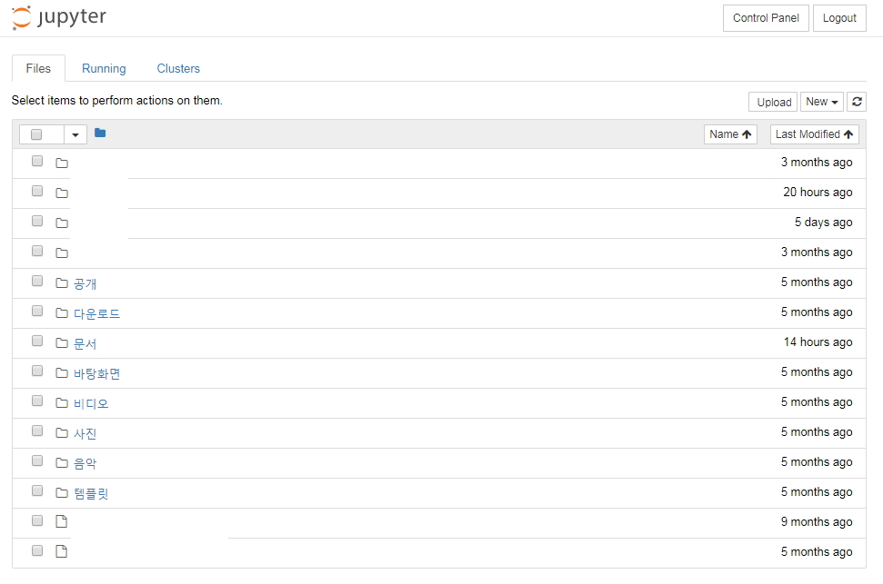
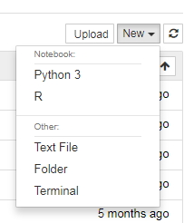
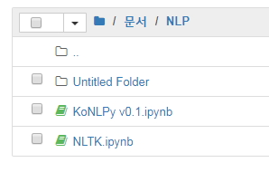
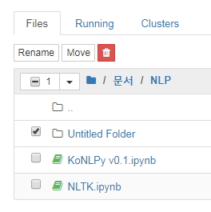
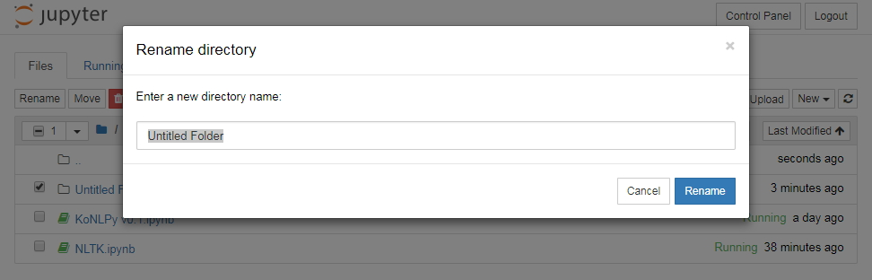
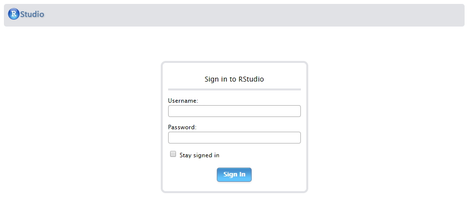

## 데모 서비스 안내
1) 현재 회사에서만 접속하실 수 있으며 스마트워크 보안시스템 적용방안을 검토 중입니다.
2) ID와 비밀번호는 슬랙에서 확인하실 수 있습니다.(#33demo_system 채녈 확인)
3) 아나콘다(Anaconda 4.4.4)를 이용하여 구성하였습니다.

### 주피터 노트북(Jupyter Notebook) 접속방법
1) 주피터 노트북은 주피터 프로젝트(http://jupyter.org/) 를 기반으로 배포되는 오픈소스 대화형 프로그래밍 웹 컴퓨팅 서비스입니다.
2) 웹브라우저를 통해 URL(http://data.kei.re.kr:8000/) 로 접속합니다.
3) numpy, pandas, tensorflow-gpu, konlpy 등 기본 라이브러리가 설치되어 있으며 설치 요청은 슬랙 또는 메일(dataq@kei.re.kr)로 주시기 바랍니다.
4) 슬랙에 공지된 ID와 비밀번호를 사용하여 로그인합니다.

5) /home/[로그인 ID] 의 디렉터리(폴더)와 파일이 표시됩니다.

6) 클릭으로 이동합니다. 파일 클릭시 새 창이 열리고 왼쪽 New 클릭하면 파일, 폴더, 서버 터미널을 열 수 있습니다.

7) 폴더를 클릭하면 Untitled Folder가 생기고

8) Unititled Folder 폴더를 선택하면 Rename(폴더명 변경), Move(폴더 이동), 폴더 삭제 기능이 표시됩니다.

9) Rename을 클릭하고 변경하고 싶은 폴더명을 넣고 Rename을 클릭하면 이름이 바뀝니다.

##

10) 위처럼 모든 기능이 직관적입니다. 잘 사용하세요.

### 알스튜디오(RStudio Server) 접속방법
1) 알스튜디오는 R 컨소시엄(https://www.rstudio.com/) 이 배포하는 무료, 유료 R 프로그래밍 소프트웨어(통합개발환경;IDE)입니다.
2) 웹브라우저를 통해 URL(http://data.kei.re.kr:8787/) 로 접속합니다.
3) 기본 라이브러리가 설치되어 있으며 필요한 라이브러는 직접 설치하시면 됩니다.
4) 슬랙에 공지된 ID와 비밀번호를 사용하여 로그인합니다.

5) /home/[로그인 ID] 의 디렉터리(폴더)와 파일이 표시됩니다.

6) 클릭으로 이동합니다. 파일 클릭시 새 창이 열리고 왼쪽 New 클릭하면 파일, 폴더, 서버 터미널을 열 수 있습니다.

7) 폴더를 클릭하면 Untitled Folder가 생기고

8) Unititled Folder 폴더를 선택하면 Rename(폴더명 변경), Move(폴더 이동), 폴더 삭제 기능이 표시됩니다.

9) Rename을 클릭하고 변경하고 싶은 폴더명을 넣고 Rename을 클릭하면 이름이 바뀝니다.

##

10) 위처럼 모든 기능이 직관적입니다. 잘 사용하세요.
