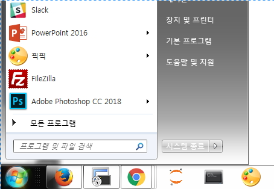
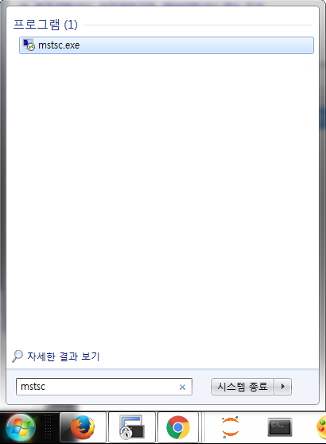
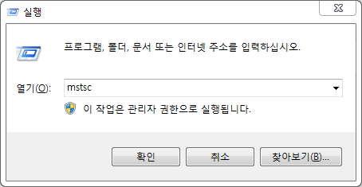
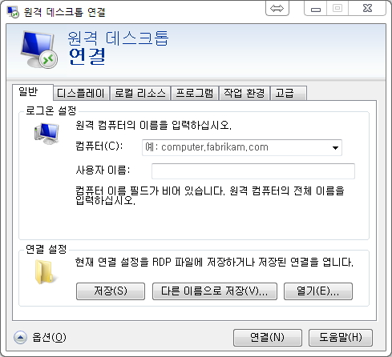
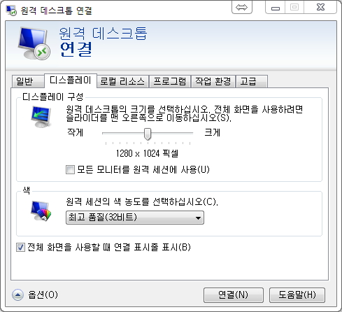
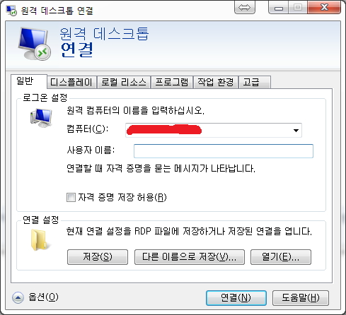
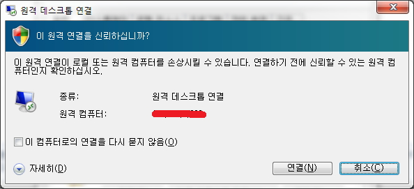
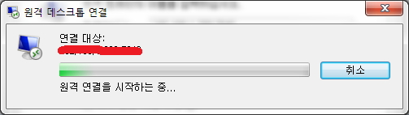

### 윈도우 데스크탑 연결(RDP)  
1. RDP을 이용하는 방법은 시작(윈도우창 아이콘) 클릭합니다.  
  
2. 프로그램 및 파일 검색을 클릭하고 mstsc를 입력하고 Enter 키를 누릅니다.  
  
또는, 실행(윈도우키 + R) > mstsc 입력 후 확인을 클릭합니다.  
  
3. RDP 소프트웨어가 실행됩니다.  
  
4. 옵션을 클릭하고 디스플레이 탭을 클릭합니다.  
  
5. 디스플레이 구성의 해상도를 변경하고 일반 탭을 클릭합니다.  
  
6. 일반 탭을 누르고 컴퓨터에 서버 주소(IP나 도메인 주소 등)를 입력하고 사용자 이름에 계정을 입력합니다. 연결을 클릭하면 접속화면이 보입니다.
  
  
  
